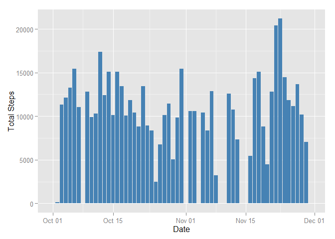

# Reproducible Research: Peer Assessment 1

```r
    library(readr)
    library(dplyr)
    library(ggplot2)
    library(lubridate)
```

## Loading and preprocessing the data

```r
    unzip("activity.zip", overwrite = TRUE)
    activity <- read_csv("activity.csv") %>% 
        mutate(interval = sprintf("%04d", interval)) %>%
        mutate(datetime = parse_date_time(paste(date, interval), orders = "YmdHM"))
```


## What is mean total number of steps taken per day?

This prepares the data by summing the steps per day.

```r
    activityTotals <- activity %>% 
        select(date,  steps) %>% 
        group_by(date) %>% 
        summarise(total_steps = sum(steps, na.rm = TRUE))
```

1. Make a histogram of the total number of steps each day

```r
    qplot(
        x = activityTotals$date,
        xlab = "Date",
        y = activityTotals$total_steps, 
        ylab = "Total Steps",
        geom = "histogram",
        stat = "identity")
```

 

2. Calculate and report the **mean** and **median** total number of steps each day.

```r
    mean(activityTotals$total_steps)
```

```
## [1] 9354.23
```

```r
    median(activityTotals$total_steps)
```

```
## [1] 10395
```

## What is the average daily activity pattern?


## Imputing missing values


## Are there differences in activity patterns between weekdays and weekends?
