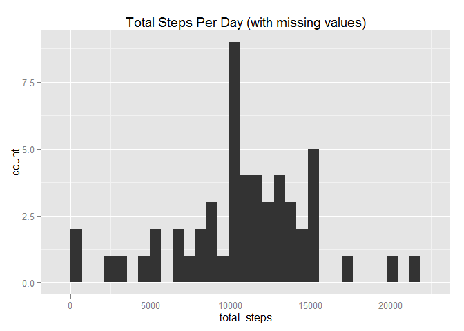

# Reproducible Research: Peer Assessment 1


```r
    library(readr)
    library(dplyr)
    library(ggplot2)
    library(lubridate)
    library(scales)
```

## Loading and preprocessing the data

```r
    unzip("activity.zip", overwrite = TRUE)
    activity <- read_csv("activity.csv") %>% 
        mutate(interval = sprintf("%04d", interval))
    #The interval is each time period as a POSIXct object with a date of the current day
    activity$intervalDate <- as.POSIXct(strptime(x = activity$interval, "%H%M"))
```


## What is mean total number of steps taken per day?

This prepares the data by summing the steps per day.

```r
    activityTotals <- activity %>% 
        select(date,  steps) %>% 
        group_by(date) %>% 
        summarise(total_steps = sum(steps, na.rm = TRUE))
```

1. Make a histogram of the total number of steps each day

```r
    qplot(
        x = activityTotals$date,
        xlab = "Date",
        y = activityTotals$total_steps, 
        ylab = "Total Steps",
        main = "Total Steps per Day (with missing values)",
        geom = "histogram",
        stat = "identity",
        fill = I("steelblue"))
```

 

2. Calculate and report the **mean** and **median** total number of steps each day.

```r
    mean(activityTotals$total_steps)
```

```
## [1] 9354.23
```

```r
    median(activityTotals$total_steps)
```

```
## [1] 10395
```

## What is the average daily activity pattern?
First let's make a new data frame containing the average number of steps in each time interval across all days.

```r
    activityByPeriod <- activity %>% 
        select(intervalDate, steps) %>% 
        group_by(intervalDate) %>% 
        summarise(mean_steps = mean(steps, na.rm = TRUE))
```

1. Make a time series plot of the average number of steps taken in each interval across all days

```r
    ggplot(data = activityByPeriod, aes(x = intervalDate, y = mean_steps)) + 
        labs(title = "Average Steps per Time Period", x = "Interval", y = "Average Steps") + 
        scale_x_datetime(labels = date_format("%H:%M")) + 
        geom_line()
```

 

2. Which 5-minute interval has the maximum number of steps?

```r
    act <- activityByPeriod
    topInterval <- act[act$mean_steps == max(act$mean_steps),]$intervalDate
    strftime(topInterval, "%H:%M")
```

```
## [1] "08:35"
```


## Imputing missing values
The approach used here is to replace any missing values with the average number of steps for that time period across all days.

1. How many days are missing data?

```r
    sum(is.na(activity$steps))
```

```
## [1] 2304
```

2. Replace NA with the mean number of steps for that period
3. Create a new dataset with the NA values filled in.

```r
    activityByPeriod <- mutate(activityByPeriod, interval = strftime(intervalDate, "%H%M"))
    filledActivity <- activity %>% 
        inner_join(activityByPeriod, by = c("interval" = "interval") ) %>% 
        mutate(filled_steps = ifelse(is.na(steps), mean_steps, steps)) %>% 
        select(date, steps = filled_steps, interval)
    
    summarisedActivity <- filledActivity %>% 
        group_by(date) %>% 
        summarise(total_steps = sum(steps))
```

4. Make a histogram of total steps per day, then show the **mean** and **median**.

```r
    qplot(
        x = summarisedActivity$date,
        xlab = "Date",
        y = summarisedActivity$total_steps, 
        ylab = "Total Steps",
        main = "Total Steps Per Day (replaced missing values)",
        geom = "histogram",
        stat = "identity",
        fill = I("steelblue"))
```

 

```r
    mean(summarisedActivity$total_steps)
```

```
## [1] 10766.19
```

```r
    median(summarisedActivity$total_steps)
```

```
## [1] 10766.19
```

The effect of imputing values in this manner has resulted in the mean and median being higher than previous, and gives us a mean equal to the median. The mean is quite significantly higher than the data with missing values, but the median is relatively similar.


## Are there differences in activity patterns between weekdays and weekends?

```r
    filled <- filledActivity %>% 
        mutate(weekend = (weekdays(date, abbreviate = TRUE) %in% c("Sat", "Sun")))
    filled$intervalDate <- as.POSIXct(strptime(x = filled$interval, "%H%M"))      
    filled$weekend = factor(x = filled$weekend, labels = c("Weekend", "Weekday"), levels = c(TRUE, FALSE))
    
    filledByPeriod <- filled %>% 
        select(intervalDate, steps, weekend) %>% 
        group_by(intervalDate, weekend) %>% 
        summarise(mean_steps = mean(steps, na.rm = TRUE))            
        
    
    ggplot(data = filledByPeriod) + 
        labs(title = "Average Steps per Time Period", x = "Interval", y = "Average Steps") + 
        scale_x_datetime(labels = date_format("%H:%M")) + 
        geom_line(mapping = aes(x = intervalDate, y = mean_steps)) + 
        facet_grid(weekend~ .)
```

 

We can see from the plot that there are some differences between weekends and weekdays. The most obvious is the change in walking before 9am - presumably as people lie in bed longer at the weekend! Through the day there's more activity at the weekend, which is likely due to people generally sitting at work through the week but being active in their free time.
